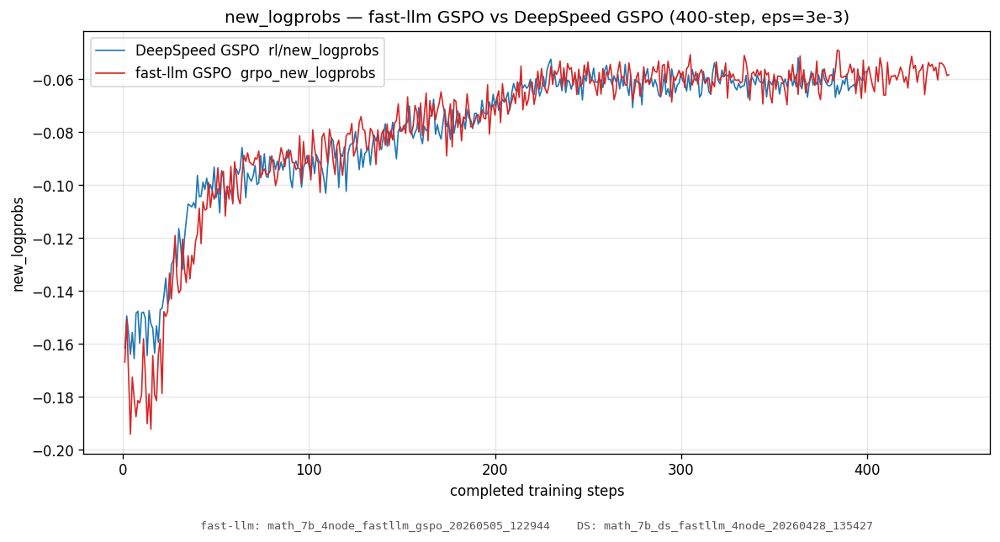
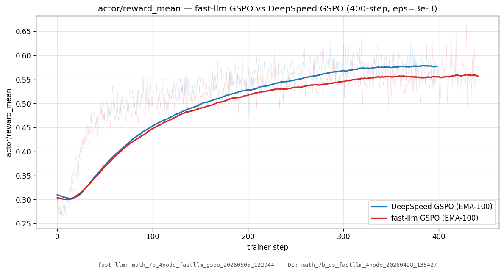

# Fast-LLM Integration — Handover

> **Status:** WIP. Last verified end-to-end on 2026-05-06 with a 2-step smoke run on a 4-node EAI job (both DeepSpeed PPO and Fast-LLM GSPO finished cleanly, all metrics in expected ranges).
>
> **Authoring history:** Denis Kocetkov (denis.kocetkov@servicenow.com) — leaving the integration project. This document is the canonical handover; the [PR description](#) on GitHub is the executive summary.

## Table of contents

1. [Why fast-llm](#1-why-fast-llm)
2. [Branch state](#2-branch-state)
3. [End-to-end install](#3-end-to-end-install)
4. [Architecture (fast-llm path)](#4-architecture-fast-llm-path)
5. [Per-file changes](#5-per-file-changes)
6. [Configuration knobs](#6-configuration-knobs)
7. [Glossary](#7-glossary)
8. [Known issues & bugs](#8-known-issues--bugs)
9. [Testing](#9-testing)
10. [Operations](#10-operations)
11. [Where data lives](#11-where-data-lives)
12. [Open questions / decisions for the successor](#12-open-questions--decisions-for-the-successor)

---

## 1. Why fast-llm

DeepSpeed ZeRO-3 is the default trainer in PipelineRL. It works, but:

- Weight updates to vLLM go over **HTTP**, gathered to rank 0 and POSTed; that's a serialization+network bottleneck on every optimizer step.
- ZeRO-3 partitioning forces a parameter all-gather every forward pass.
- DeepSpeed's loss/gradient pipeline is harder to extend with custom RL loss kernels (GSPO, GRPO with advanced metrics).

[Fast-LLM](https://github.com/ServiceNow/Fast-LLM) replaces the trainer with FSDP + sequence-data-parallel (SDP) and broadcasts weights to vLLM over a **persistent NCCL group** instead of HTTP. The integration also adds custom GSPO/GRPO loss kernels with full DS parity (see PR #502 in the Fast-LLM repo).

Goals:

- **Higher GPU utilization** by avoiding HTTP serialization on every step.
- **More on-policy data** because broadcasts can run concurrently with vLLM generation.
- **Custom RL losses** (GSPO, sequence-level IS-ratio clipping) that are first-class in fast-llm.

## 2. Branch state

| Repo | Branch | Status |
|---|---|---|
| `ServiceNow/PipelineRL` | `fast-llm` | WIP, this PR's source branch |
| `ServiceNow/Fast-LLM` | `gspo` | WIP, Fast-LLM PR [#502](https://github.com/ServiceNow/Fast-LLM/pull/502) |

The two branches must be used together. Fast-LLM's `gspo` branch contains the GSPO loss kernels, the divisor² + SDP loss-math fix, the `metrics: GRPOMetricsLevel` enum (merged from `grpo-metrics`), and `fp32_lm_head` precision matching for vLLM. The PipelineRL `fast-llm` branch contains the launcher integration, weight-broadcast plumbing, multi-node fixes, and the test suite (`tests/test_vllm1_*`, `tests/test_world_multinode.py`, `tests/test_actor_error_handling.py`).

### Active CI

There is **no CI specific to the fast-llm path**. Unit tests in `tests/` exercise weight-broadcast and multi-node behavior but do not run a full pipeline. Verifying the path requires a live multi-node smoke (see [§9 Testing](#9-testing)).

## 3. End-to-end install

### Image

**To use**, reference the prebuilt image directly:

```
registry.toolkit-sp.yul201.service-now.com/snow.research.afm/interactive-toolkit:25.12-py3-vllm014rc1redis
```

It bundles the redis server (used by `streams=redis`).

**To build it yourself** (e.g. when bumping the PyTorch / vLLM version — see open question 6 below): clone the [`ServiceNow/research-interactive-toolkit`](https://github.com/ServiceNow/research-interactive-toolkit/tree/fml/pytorch_vllm014rc1) repo (SN-internal, link is gated), check out branch `fml/pytorch_vllm014rc1`, then set `~/.research-interactive-env` and run the toolkit's build target:

```shell
USE_ACCOUNT_REPO := 1
BASE_IMAGE := nvcr.io/nvidia/pytorch:25.12-py3
IMAGE_REVISION := 25.12-py3-vllm014rc1redis
EAI_PROFILE := yul201
```

Base layer is `nvcr.io/nvidia/pytorch:25.12-py3`; the branch layers on vLLM 0.14.0rc1, redis, and the EAI helpers.

### Launching an interactive EAI job (prereq for the example scripts)

The example scripts under `examples/interactive/` are meant to be run **from inside an interactive EAI session that has 4 nodes attached**. To start such a session:

1. Clone the toolkit repo (one-time): `git clone git@github.com:ServiceNow/research-interactive-toolkit.git ~/code/research-interactive-toolkit`. For the vLLM 0.14.0rc1 image, check out branch `fml/pytorch_vllm014rc1`; for the future-bumped image, use whichever branch builds it.
2. Configure `~/.research-interactive-env` per the block above (selects image revision and EAI profile).
3. Launch and attach with VSCode Remote-SSH (full instructions in the toolkit README — `make launch`, then `eai job ls` to find your job, then connect via Remote-SSH).
4. Inside the running interactive container, follow [§3 End-to-end install](#3-end-to-end-install) above to clone Fast-LLM + PipelineRL into the venv, then `bash examples/interactive/{fast_llm,ds}_4node.sh`.

For multi-node interactive jobs (4 nodes × 8 GPUs needed for the chart-reproducing runs), bump `GPU`, `CPU`, `MEM` and add `--replicas 4` semantics in `~/.research-interactive-env` per the toolkit README's multi-replica instructions.

### Steps

```bash
git clone git@github.com:ServiceNow/Fast-LLM.git
git clone git@github.com:ServiceNow/PipelineRL.git

cd PipelineRL
/usr/bin/python3.12 -m venv --system-site-packages .venv
source .venv/bin/activate
export PIP_CONSTRAINT=""

cd ../Fast-LLM
git submodule update --init --recursive
git checkout gspo
pip install --no-cache-dir --no-build-isolation \
  -e ".[CORE,OPTIONAL,HUGGINGFACE,SSM,VISION,GENERATION,STREAMING,DEV]" \
  triton==3.5.1

cd ../PipelineRL
git checkout fast-llm
pip install --no-cache-dir -e ".[lora]"
```

### Troubleshooting

| Symptom | Cause | Fix |
|---|---|---|
| `pip` resolves wrong transformers / accelerate versions | `[tool.uv]` override in `pyproject.toml:81-87` only applies to uv | Stay on the listed versions; do not enable the `[tapeagents]` extra on this branch |
| Triton kernel compile errors on first GSPO step | Triton version drift | `pip install triton==3.5.1` (newer breaks GSPO kernels) |
| `pip install` killed mid-build | Default `TMPDIR=/tmp` ephemeral quota (16 GiB) on EAI | `export TMPDIR=$HOME/.tmp; mkdir -p $TMPDIR` before installing |
| `_GLIBCXX_USE_CXX11_ABI` mismatch when loading vLLM | PyTorch wheel C++ ABI mismatch | Check `python -c "import torch; print(torch._C._GLIBCXX_USE_CXX11_ABI)"` and pick the right vLLM wheel (the toolkit image already matches) |
| `PIP_CONSTRAINT` errors | The toolkit image ships a constraints file conflicting with our pinned versions | `export PIP_CONSTRAINT=""` before any `pip install` |

## 4. Architecture (fast-llm path)

```
┌─ orchestrator (pipelinerl.launch) ──────────────────────────────────┐
│                                                                     │
│   1. pre-creates a TCPStore on world.actor_group_port (rank 0 only) │
│      because torchrun sets TORCHELASTIC_USE_AGENT_STORE=True which  │
│      makes every rank a client by default → no server, no rendezvous│
│   2. launches actor (vLLM) and finetune (fast-llm) processes        │
│                                                                     │
└─────────────────────────────────────────────────────────────────────┘
       │                                               │
       ▼                                               ▼
┌─ vLLM (run_vllm1.py) ────────┐    ┌─ fast-llm trainer (torchrun) ──┐
│                              │    │                                │
│  init_actor_update_group(    │    │  StreamingTrainerCallback:     │
│    group_name=               │◄──►│    - gather weights            │
│      WEIGHTS_BROADCAST_PG_   │    │    - broadcast on NCCL group   │
│      NAME)                   │    │    - xadd "step_done" event    │
│                              │    │                                │
│  on "training_finished":     │    │  on final step:                │
│    destroy_actor_update_     │    │    xadd "training_finished"    │
│      group()                 │    │                                │
│                              │    │                                │
└──────────────────────────────┘    └────────────────────────────────┘
       │                                               │
       └──── redis (streams=redis) ────────────────────┘
              ▲
              │
       ┌──────┴────────────┐
       │  actor processes  │
       │  (rollouts in)    │
       └───────────────────┘
```

### Weight-broadcast NCCL group

| Property | Value | Source |
|---|---|---|
| Group name | `WEIGHTS_BROADCAST_PG_NAME` | both sides use the same string → matching store prefixes |
| Init method | `tcp://<master_addr>:9000` | `world.actor_group_port` from `conf/base.yaml` |
| TCPStore server | rank 0 of orchestrator (master node) | `pipelinerl/launch.py:998-1019` (only when `use_fast_llm and weight_broadcast`) |
| Member processes | trainer rank 0 (writer) + every vLLM worker (readers) | trainer joins via `init_extra_process_group(group_name=WEIGHTS_BROADCAST_PG_NAME)`; vLLM joins via `vllm1.init_actor_update_group` (`pipelinerl/vllm1.py:86-145`) |

### Why pre-create the TCPStore

When fast-llm runs under torchrun, every fast-llm process inherits `TORCHELASTIC_USE_AGENT_STORE=True` (hardcoded in `StaticTCPRendezvous.use_agent_store` — there is no flag to disable it). PyTorch's `_create_c10d_store` then treats every rank as a client. If nobody pre-creates the server, both fast-llm rank 0 and the vLLM workers spin retrying connection-refused on port 9000.

Fix in `pipelinerl/launch.py:998-1019`: on `world_map.my_rank == 0`, create a `TCPStore(is_master=True, wait_for_workers=False)` on `world_map.master_addr:actor_group_port` before launching child processes, and keep the `broadcast_store` local alive until `watch_processes_running` returns. fast-llm and vLLM both then connect as clients to this pre-existing server.

### Coordinated NCCL teardown

`dist.destroy_process_group()` is a collective; if one side calls it and the other doesn't, the calling side hangs. The trainer xadds `{"type": "training_finished"}` to the `fast_llm_events` redis stream (see `FAST_LLM_EVENTS_STREAM` in `pipelinerl/state.py:20`); vLLM's monitoring thread (`pipelinerl/vllm1.py:484-547`) handles the event by calling `self.destroy_actor_update_group()` and setting `_fast_llm_stop_event`. Both sides then hit the collective barrier simultaneously.

## 5. Per-file changes

This is the high-impact subset, not exhaustive. Use `git log origin/main..fast-llm` for the full list.

### Orchestrator / launcher

| File | What | Why |
|---|---|---|
| `pipelinerl/launch.py:55-57` | Reject the deprecated top-level `fp32_lm_head` knob | After PR #137, fp32 is always-on; passing the old knob now warns |
| `pipelinerl/launch.py:88, 211, 246, 331, 397, 434-460` | Branch on `cfg.use_fast_llm` for finetune launch, callbacks injection, and weight-broadcast wiring | Replaces DS-only paths |
| `pipelinerl/launch.py:454-460` | Inject `callbacks.streaming.broadcast.{host,port,external_world_size}` from `world_map` | Lets fast-llm find the TCPStore at runtime |
| `pipelinerl/launch.py:998-1019` | Pre-create the broadcast `TCPStore` on rank 0 | Workaround for torchrun client-only rendezvous behavior |

### State / actor

| File | What | Why |
|---|---|---|
| `pipelinerl/state.py:24-29` | `samples_processed=0` in fast-llm mode (was `None`) | `wait_for_processed_samples()` would block at startup otherwise |
| `pipelinerl/state.py:64-141` | Background thread reading the `fast_llm_events` redis stream | Polls fast-llm trainer progress (samples processed, training_finished) |
| `pipelinerl/state.py:153-...` | `wait_for_training_done(timeout)` helper | Used by orchestrator shutdown |
| `pipelinerl/actor.py:158, 613-614` | `samples_target = max_train_steps × train_batch_size × gradient_accumulation_passes` | **See [§8 actor overshoot bug](#actor-overshoot)** — this assumption is wrong for fast-llm and stops the actor too early |

### vLLM v1 worker

| File | What | Why |
|---|---|---|
| `pipelinerl/vllm1.py:86-145` | `init_actor_update_group(group_name=WEIGHTS_BROADCAST_PG_NAME)` for fast-llm; `group_name="actor"` for HTTP mode | Matching store prefixes for rendezvous |
| `pipelinerl/vllm1.py:147-180` | `destroy_actor_update_group()` callable | NCCL teardown |
| `pipelinerl/vllm1.py:462, 484-547` | Background thread that consumes `fast_llm_events`; on `training_finished` schedules `destroy_actor_update_group` | Coordinated teardown |
| `pipelinerl/vllm1.py:567-571` | Fallback: forces stop if `training_finished` never arrives | Defensive |

### Async LLM client (rollout retries)

| File | What | Why |
|---|---|---|
| `pipelinerl/async_llm.py:61, 137-146, 194` | Retryable abort detection + `attempt=1/2` retry | vLLM aborts in-flight completions when weights are updated; we retry once |

### Configs

| File | What | Why |
|---|---|---|
| `conf/math.yaml:5-6` | `use_fast_llm: true` and `weight_broadcast: true` defaults | This config is the one verified end-to-end |
| `conf/base.yaml:78-89` | `world.actor_fraction`, `world.finetune_fraction`, `world.run_id` | Multi-node knobs |
| `conf/base.yaml:185-202` | `fast_llm.callbacks.streaming.broadcast.*` block (placeholder values) | Gets filled in at launch time by the launcher (see launch.py:454-460) |

### Tests

The fast-llm branch adds `tests/test_vllm1_fast_llm_broadcast.py`, `tests/test_vllm1_integration.py`, `tests/test_world_multinode.py`, `tests/test_actor_error_handling.py`, plus helpers (`tests/{vllm_engine_helper,distributed_trainer_helper,fast_llm_trainer_helper,server_weight_update_utils}.py`). They exercise weight-broadcast on a single host with a fake trainer + 1-3 vLLM workers (TP=1 or TP=2). They do **not** run a full multi-node pipeline.

## 6. Configuration knobs

PipelineRL side (Hydra overrides at launch):

| Knob | Default | Notes |
|---|---|---|
| `use_fast_llm` | `false` (true in `math.yaml`) | Switches finetune path between DS and fast-llm |
| `weight_broadcast` | `true` | Enables NCCL broadcast group; disabling falls back to per-step HTTP weight updates |
| `streams` | `files` | **Must be `redis`** with `use_fast_llm=true` (files-mode dataset isn't implemented for fast-llm — see [§8 streams=files](#streams-files-not-supported)) |
| `world.actor_fraction` | `1` | Number of nodes hosting actor (vLLM) processes |
| `world.finetune_fraction` | `0` | Number of nodes hosting fast-llm trainer |
| `world.run_id` | `null` | **Required for multi-node** — see README §"Running and resuming multi-node jobs" |
| `world.actor_group_port` | `9000` | Broadcast TCPStore port |

Fast-LLM side (passed as `+fast_llm.<path>=value`):

| Knob | Default | Notes |
|---|---|---|
| `fast_llm.model.distributed.sequence_data_parallel` | `1` | Set to `2` for 7B-math; loss-math fix divides by `sdp_size` (Fast-LLM `loss/grpo.py`) |
| `fast_llm.schedule.docs_per_step` | (set per run) | Documents per training step (e.g. 1024 for 7B-math) |
| `fast_llm.model.base_model.head.fp32_lm_head` | `false` | **Must be `true`** to match vLLM's `bf16_last_layer_fp32` precision (otherwise IS ratios diverge) |
| `fast_llm.model.base_model.head.losses.grpo.policy_loss` | `grpo` | `gspo` for sequence-level geometric-mean clipping |
| `fast_llm.model.base_model.head.losses.grpo.epsilon_low/_high` | `0.2 / 0.2` | Clipping thresholds |
| `fast_llm.model.base_model.head.losses.grpo.normalize_by_documents` | `false` | **Must be `true`** to match DeepSpeed's `1/batch_size` token weighting |
| `fast_llm.model.base_model.head.losses.grpo.temperature` | `1.0` | Set to actor's sampling temperature (e.g. `0.7`) so IS ratios start near 1 |
| `fast_llm.model.base_model.head.losses.grpo.metrics` | `none` | `none`/`basic`/`with_entropy` (see Fast-LLM PR #494). Replaces the old `compute_extra_metrics`/`compute_entropy_metric` flags |

## 7. Glossary

- **GRPO** — Group Relative Policy Optimization. Per-token IS-ratio clipping policy-gradient loss.
- **GSPO** — Group Sequence-level Policy Optimization. Geometric-mean IS-ratio clipping over the whole sequence (all tokens get the same multiplier).
- **DP / FSDP** — Data Parallel / Fully Sharded DP. FSDP shards parameters and gathers them on demand.
- **SDP** — Sequence Data Parallel (Fast-LLM concept). A second axis of parallelism that splits the *sequence* dimension across ranks. Requires extra all-reductions inside the loss.
- **ZeRO Stage 3** — DeepSpeed's parameter sharding. Equivalent to FSDP-1.
- **Microbatch / docs_per_step** — `docs_per_step` is the trainer's logical step size in *documents*. Each step consumes that many rollout documents; gradient accumulation breaks this into microbatches.
- **Broadcast PG** — the NCCL process group used to push weights from trainer rank 0 to vLLM workers. Created once and reused for every weight update.
- **`bf16_last_layer_fp32`** — vLLM's option to keep the LM head in fp32 while the rest of the model runs bf16. The trainer must match this exactly or IS ratios drift.

## 8. Known issues & bugs

### <a id="actor-overshoot"></a>Actor `_prefetch_to_doc_target` overshoot — premature run end

- **Symptom:** Long fast-llm runs (50+ steps) end before the configured `max_train_steps`. Actor signals completion → trainer stalls on the next step → `TimeoutError: No document received after 600 seconds`. Trainer reaches step ~43 of 50, run ends.
- **Root cause:** `pipelinerl/actor.py:158, 613-614` computes `samples_target = max_train_steps × train_batch_size × gradient_accumulation_passes` assuming exactly 1024 docs/step. Fast-LLM's `_prefetch_to_doc_target` (in Fast-LLM `fast_llm/engine/training/trainer.py:160-179`) overshoots `docs_per_step` by ~5–17% because of `while total_docs < target`. At runtime each step actually consumes ~1197 docs vs the 1024 target. The actor sees `samples_processed` cross `samples_target` early, signals completion, stops producing.
- **Workaround:** bump `max_train_steps` by ~20% (e.g. 50 → 60) so the actor has headroom.
- **Real fix:** make `actor.py:613` overshoot-aware (e.g. multiply by `(1 + safety_margin)` derived from `_prefetch_to_doc_target` actual ratio) or have the trainer signal "done" instead of the actor inferring it.
- **Memory file:** `project_actor_samples_target_overshoot_bug.md`.

### Rollout retry exhaustion — occasional hang on bursts

- **Symptom:** Actor logs show `Retryable aborted completion ... attempt=2/2 reason=finish_reason=abort`. Sometimes the second retry also aborts (because another weight update fires before the rollout completes), the request is dropped, and the rollout sits in the actor's "in_progress" tracking forever, blocking that slot.
- **Root cause:** vLLM aborts in-flight requests during weight updates. `pipelinerl/async_llm.py:137-146` retries once. Under bursty weight updates a single rollout can hit two consecutive aborts.
- **Workaround:** none currently; happens infrequently.
- **Real fix:** allow more retries (config flag), or make the actor evict rollouts that are stuck without a final response after N seconds.
- **Memory file:** `project_stall_investigation.md` (related, has more context).

### Reward lag vs DeepSpeed — lower `actor/reward_mean`

- **Symptom:** Even with exact `grpo_new_logprobs` parity (DS step 50 = -0.105, fast-llm step 50 = -0.103), fast-llm's `actor/reward_mean` lags DS by 2–3 EMA points throughout training. By step 400, fast-llm's `no_answer_mean` is **51× DS** (3.1% vs 0.06%).
- **Root cause:** Unknown. The trained model receives identical gradients (newlp parity verified), so the gap is upstream of the trainer — most likely in the data pipeline or in run-to-run sampling variance. Needs investigation, not a known fix.
- **Memory file:** `project_fastllm_reward_lag_after_gspo_fix.md`.

### <a id="streams-files-not-supported"></a>Current limitation: `streams=files` is not implemented for `use_fast_llm=true`

Not a bug, just a current limitation: Fast-LLM only ships `RedisStreamingDataset`, so this branch requires `streams=redis`. If you launch with `use_fast_llm=true streams=files` you'll get an error from the launcher. **Memory file:** `project_streams_files_not_supported_fast_llm.md`.

## 9. Testing

### Unit tests (single host)

```bash
cd /home/toolkit/code/PipelineRL
source .venv/bin/activate
pytest tests/test_vllm1_fast_llm_broadcast.py     # weight broadcast
pytest tests/test_vllm1_integration.py            # vLLM v1 path
pytest tests/test_world_multinode.py              # topology / port assignment
pytest tests/test_actor_error_handling.py         # rollout retry
```

These run on 1-3 GPUs (the helpers spawn TP=1 or TP=2 vLLM engines plus a fake trainer).

### Multi-node smoke (4-node, 2-step)

The interactive scripts under `examples/interactive/` run a 2-step smoke against the GSPO config (fast-llm) or the PPO config (DeepSpeed):

```bash
bash examples/interactive/fast_llm_4node.sh   # fast-llm + vLLM v1 + GSPO
bash examples/interactive/ds_4node.sh         # DeepSpeed + vLLM v1 + PPO
```

Both should hit the trainer's "Reached final step 2, stopping" / "Saving checkpoint at iteration 2" log line within ~10 minutes of `RUNNING`. See those scripts for the prereqs and success criteria.

### Last verified (2026-05-06)

| Smoke | Job ID | Step 1 grad_norm | Step 2 grad_norm | Step 1 newlp | Step 2 newlp | NaN |
|---|---|---|---|---|---|---|
| fast-llm GSPO | `59f3b62f` | 0.166 | 0.173 | -0.171 | -0.162 | 0 |
| DeepSpeed PPO | `084ef7d8` | 0.201 | 0.247 | -0.162 | -0.146 | 0 |

### 400-step training curves: fast-llm GSPO vs DeepSpeed GSPO

Comparing fast-llm `math_7b_4node_fastllm_gspo_20260505_122944` (the divisor² + SDP fix run) against DeepSpeed `math_7b_ds_fastllm_4node_20260428_135427` (matching GSPO config: `policy_loss=gspo`, `epsilon_low=3e-3`, 400 steps).

**`new_logprobs` — fast-llm matches DS step-by-step** (the GSPO loss math fix is correct):



**`actor/reward_mean` — fast-llm lags DS by ~2 points at step 400** (the open issue, root cause unknown):



### Personalize before running

Both the example scripts and the production submit launchers default to Denis's setup. Before running, override these env vars (or edit the defaults in the scripts) to your own:

| Env var | Default | What it is |
|---|---|---|
| `RESULTS_DIR` | `/mnt/shared/denis/math_7b_results` | Where outputs / checkpoints / logs land. Must be on a shared NFS readable by every node. |
| `WANDB_ENTITY` | `denisko-se` | Your wandb entity (user or org). |
| `WANDB_PROJECT` | `watermelon` | Your wandb project. |
| `EAI_HOME_DATA` | `snow.home.denis_kocetkov` | Your EAI home data object (mounted at `/home/toolkit` inside the container). Submit-only. |
| `EAI_SHARED_DATA` | `snow.research.afm.shared_fml` | Your shared NFS data object (mounted at `/mnt/shared`). Submit-only. |
| `MODEL_PATH` | `/home/toolkit/Qwen2.5-7B` | Path to the base model checkpoint inside the container. |

The two `EAI_*_DATA` knobs only matter for the `submit_eai_*.sh` scripts (they're passed to `eai job new --data`); the `examples/interactive/*.sh` scripts run inside an existing session and use whatever's already mounted.

The handover doc and PR description also mention `denisko-se/watermelon` runs and `/mnt/shared/denis/math_7b_results/` paths — those are pointers to Denis's historical runs and stay as-is for traceability; you don't need to edit them, just point your own runs to your own places.

### Reproduction recipes

Two paths depending on whether you have an interactive EAI job or want to submit a batch job:

| Where you run from | Script (in this repo) | What it does |
|---|---|---|
| **Inside interactive 4-node EAI session** | [`examples/interactive/fast_llm_4node.sh`](../examples/interactive/fast_llm_4node.sh) | Reproduces fast-llm side of the charts at `MAX_TRAIN_STEPS=400` (defaults to 2 for smoke). |
| **Inside interactive 4-node EAI session** | [`examples/interactive/ds_4node.sh`](../examples/interactive/ds_4node.sh) | Reproduces DS GSPO side of the charts at `MAX_TRAIN_STEPS=400` (defaults to 2 for smoke). |
| **Submit as standalone EAI batch job** | [`submit_eai_math_7b_multinode.sh`](../submit_eai_math_7b_multinode.sh) | Production fast-llm GSPO launcher. Calls `eai job new --replicas 4`. The exact script that produced `math_7b_4node_fastllm_gspo_20260505_122944` (the chart's fast-llm run). |
| **Submit as standalone EAI batch job** | [`submit_eai_math_7b_multinode_ds_fastllm_branch.sh`](../submit_eai_math_7b_multinode_ds_fastllm_branch.sh) | Production DS GSPO launcher (DS trainer + vLLM v1, GSPO loss). The exact script that produced `math_7b_ds_fastllm_4node_20260428_135427` (the chart's DS run). |

The `examples/interactive/*.sh` scripts are byte-equivalent to the `submit_eai_*.sh` ones modulo (a) they don't call `eai job new` (you supply your own session) and (b) defaults are smoke-friendly (`MAX_TRAIN_STEPS=2`). Override `MAX_TRAIN_STEPS=400` to reproduce the charts.

## 10. Operations

### Where logs live

For an EAI-launched job with `output_dir=/mnt/shared/.../<EXP_NAME>`:

| Log | Path |
|---|---|
| Orchestrator | `<EXP_DIR>/launch.log` |
| fast-llm trainer | `<EXP_DIR>/finetune/stdout_node{N}.log` (per-rank training metrics on stdout) |
| DeepSpeed trainer | `<EXP_DIR>/finetune/stderr_node{N}.log` (`pipelinerl.finetune_loop - Completed steps N: {...}`) |
| Actor | `<EXP_DIR>/actor/info.log` and `actor/debug.log` |
| vLLM workers | `<EXP_DIR>/actor_vllm_<i>/{stdout,stderr}.log` |
| Redis | `<EXP_DIR>/redis/redis.log` |

**Common gotcha:** fast-llm prints step metrics to **stdout**; DeepSpeed prints them to **stderr** as `pipelinerl.finetune_loop` log lines. Both are normal; don't grep one and assume the other is broken.

### How to monitor a running EAI job

```bash
eai job ls --account snow.research.afm | grep <job-id>
eai job logs <job-id>                       # streamed
eai job kill <job-id>                       # graceful shutdown signal
```

For shutdown semantics, **always** SIGINT the launch process (don't `kill -9` the children) — the orchestrator's coordinated NCCL teardown depends on a clean signal path.

### WandB

- Project: `denisko-se/watermelon`
- Group: `eai_math7b_fastllm_gspo` (fast-llm) / `eai_math7b_ds_fastllm` (DS)
- Run name: set via `+wandb.wandb_run_name=...`

## 11. Where data lives

| What | Where |
|---|---|
| Shared NFS results dir | `/mnt/shared/denis/math_7b_results/` |
| Model checkpoints (Qwen2.5-7B) | `/home/toolkit/Qwen2.5-7B/` |
| Code (PipelineRL, Fast-LLM) | `/home/toolkit/code/{PipelineRL,Fast-LLM}/` |
| venv | `/home/toolkit/code/PipelineRL/.venv/` |

## 12. Open questions / decisions for the successor

1. **Fix or compensate the actor overshoot?** Cleanest is to make the trainer signal "done" instead of the actor computing a target. Workaround is a constant safety multiplier in `actor.py:613`.
2. **Reward lag root cause.** Need to identify where the gap comes from before deciding whether it's worth fixing on this branch.
3. **Should the GSPO loss math fix (Fast-LLM PR #502) be merged before this PipelineRL PR?** Yes — this PR pins to the `gspo` branch by name; once `gspo` merges to Fast-LLM `main` we should rev this branch's install instructions to use `main`.
4. **Resolve the commented-out `pyproject.toml` overrides** (`pyproject.toml:81-87`). The `[tool.uv]` block force-overrides `transformers>=4.51.0` / `accelerate>=1.7.0` because `tapeagents==0.1.16` pins them lower; the `[tapeagents]` extra is broken at runtime as a result. Either bump tapeagents (when upstream supports newer libs) or drop the extra altogether on this branch.
5. **Close metric gaps on the fast-llm finetune side**, e.g. `rl/ess` (effective sample size — diagnostic for data/policy drift). Diff DS's `rl/*` and `stats/*` against fast-llm's `training.*` and pick what's worth porting.
6. **Move off the interactive-toolkit base image and the vLLM 0.14.0rc1 pin.** Current image is `interactive-toolkit:25.12-py3-vllm014rc1redis` (PyTorch 25.12 + vLLM 0.14.0rc1 + bundled redis). Step up to the latest base PyTorch and vLLM versions that Fast-LLM and PipelineRL both support, then re-verify the smoke runs.
